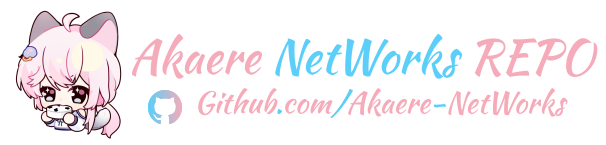

# Akaere Networks

Welcome to Akaere Networks! We are a group of internet enthusiasts and tech geeks who love tinkering with networks. We own Autonomous System Number (ASN) 210440, and AKIX is just one of our many projects.

Akaere Networks is dedicated to driving innovation and open collaboration in internet infrastructure. We focus on areas such as network interconnection, automation, and distributed systems, encouraging our members to freely explore, share experiences, and grow together.

We operate [AKIX](https://www.peeringdb.com/ix/4718) — an open, flexible, and zero-membership-fee Internet Exchange Point (IXP), ASN 210440. AKIX provides efficient and transparent interconnection solutions for network service providers, content delivery networks, and various organizations. Whether you prefer physical connections, virtual access, or hybrid modes, we make direct peering easy, help reduce transmission costs, and enhance network resilience.

We believe in the power of openness and collaboration. We welcome more friends to join our interconnected ecosystem and make the internet more fun and robust together!

- [PeeringDB: AKIX 210440](https://www.peeringdb.com/ix/4718)

Interested? Have questions? Want to join us? Feel free to reach out anytime!

Our team members come from all over the world, each with different backgrounds and expertise, but all share a passion for the internet and a curiosity for technology. Whether you are a seasoned network pro or a curious newcomer, as long as you love to explore and share, you are welcome here!

Let's connect the world with technology and make the internet freer and more interesting together!
